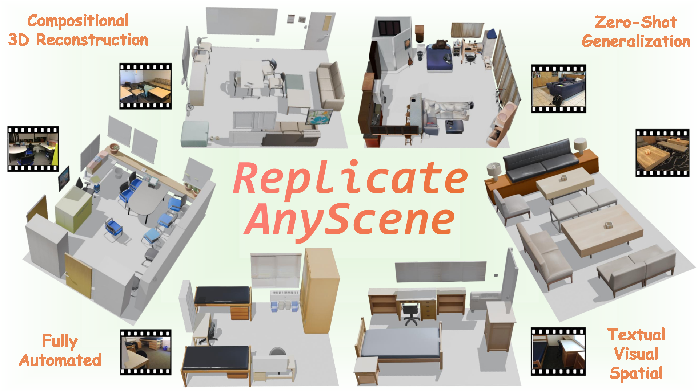
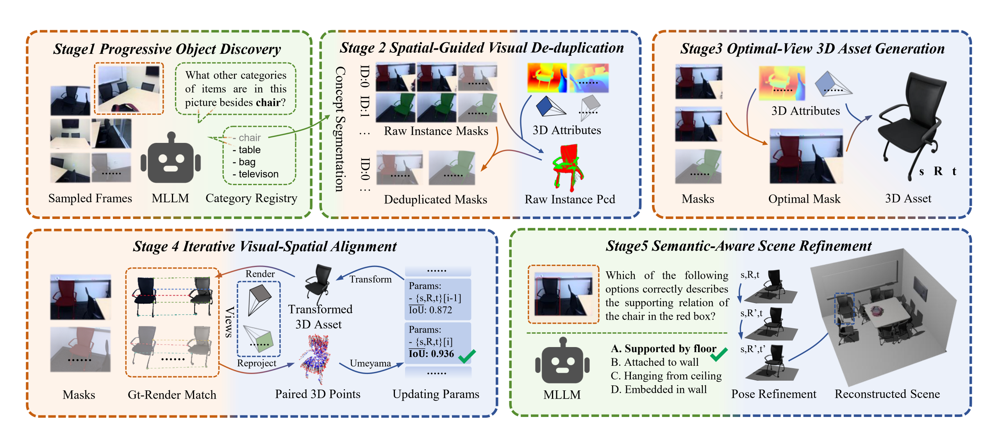

<div align="center">

# ✨ReplicateAnyScene: Zero-Shot Video-to-3D Composition via Textual-Visual-Spatial Alignment✨

<p align="center">
<a href="https://dongmingyu111.github.io/">Mingyu Dong</a><sup>1,*</sup>,
<a href="https://xiac20.github.io/">Chong Xia</a><sup>1,*</sup>,
Mingyuan Jia<sup>1</sup>,
<a href="https://matthew-lyu.github.io/">Weichen Lyu</a><sup>1</sup>,
<a href="https://gaolon.github.io/xulong/">Long Xu</a><sup>2</sup>,
<a href="https://www.zhengzhu.net/">Zheng Zhu</a><sup>1</sup>,
<a href="https://duanyueqi.github.io/">Yueqi Duan</a><sup>1,†</sup>
<br>
<sup>1</sup>Tsinghua University &nbsp;
<sup>2</sup>Zhejiang University
</p>

<!-- <h3 align="center">CVPR 2026 🔥</h3> -->

<a href="https://arxiv.org/abs/2603.02133"></a> &nbsp;&nbsp;&nbsp;&nbsp;
<a href="https://xiac20.github.io/ReplicateAnyScene/"></a> &nbsp;&nbsp;&nbsp;&nbsp;
<a></a> &nbsp;&nbsp;&nbsp;&nbsp;


</div>

**ReplicateAnyScene:** We propose ReplicateAnyScene, a framework capable of fully automated and zero-shot transformation of casually captured videos into compositional 3D scenes.

## 📢 News
- 🔥 [04/10/2026] We release the code for stage 2 and 3, as well as partial code for stage 1 and 5.
- 🔥 [04/10/2026] We release "ReplicateAnyScene: Zero-Shot Video-to-3D Composition via Textual-Visual-Spatial Alignment". Check our [project page](https://xiac20.github.io/ReplicateAnyScene) and [arXiv paper](https://arxiv.org/abs/2603.02133).


## 🌟 Pipeline



<strong>The overall framework of our approach ReplicateAnyScene.</strong> Our pipeline consists of a five-stage cascade where each stage is specifically designed to resolve targeted alignment gaps among our three core modalities including **textual (green), visual (orange), and spatial (blue)**. The gradient backgrounds and multi-colored dashed borders within each module explicitly illustrate the specific cross-modal alignment process occurring at that step.

<!-- ## 🎨 Video Demos

<video width="100%" controls autoplay loop muted>
  <source src="assets/demo.mp4" type="video/mp4">
</video> -->

## ⚙️ Setup

### 1. Clone Repository and update submodules

```bash
git clone https://github.com/xiac20/ReplicateAnyScene.git
cd ReplicateAnyScene
git submodule update --init --recursive
```

### 2. Environment Setup

1. **Create conda environment**

```bash
conda env create -f environments/default.yml
conda deactivate
conda activate ReplicateAnyScene
```

2. **Install SAM3D-related dependencies**

```bash
cd sam-3d-objects
# for pytorch/cuda dependencies
export PIP_EXTRA_INDEX_URL="https://pypi.ngc.nvidia.com https://download.pytorch.org/whl/cu121"

# install sam3d-objects and core dependencies
pip install -e '.[dev]'
pip install -e '.[p3d]' # pytorch3d dependency on pytorch is broken, this 2-step approach solves it

# for inference
export PIP_FIND_LINKS="https://nvidia-kaolin.s3.us-east-2.amazonaws.com/torch-2.5.1_cu121.html"
pip install -e '.[inference]'

# patch things that aren't yet in official pip packages
./patching/hydra # https://github.com/facebookresearch/hydra/pull/2863

cd ../ # back to root
```

3. **Install SAM3,VGGT,and other dependencies**

```bash
cd sam3
pip install .[dev,notebooks,train]
cd ../vggt
pip install -e .
cd ..
pip install colorcet
```

4. **Download required models.**

```bash
mkdir models
hf download facebook/VGGT-1B  --local-dir models/VGGT
hf download facebook/sam3 --local-dir models/SAM3
hf download facebook/sam-3d-objects --local-dir models/SAM3D
```

## 💻Run Examples

We provide an example scene to help you get started.

```bash
python main.py --input_video ./assets/example/hallway.mp4 --output_path ./outputs/hallway --category_path ./assets/example/hallway.json --max_frames 160
```
- `--input_video`: Path to the input video file or a directory containing image frames.
- `--output_path`: Directory where the output results will be saved.
- `--category_path`: Path to the JSON file containing category and relation information for the scene.
- `--max_frames`: Maximum number of frames to process from the video. The default value is set to 160 for a GPU with 48GB VRAM. You can adjust this value based on your hardware capabilities.

## 🔗Acknowledgement

We are thankful for the following great works when implementing SimRecon:

- [SimRecon](https://github.com/xiac20/SimRecon), [Spatial-MLLM](https://github.com/THU-SI/Spatial-MLLM), [SAM3](https://github.com/facebookresearch/sam3), [SAM3D](https://github.com/facebookresearch/sam-3d-objects), [VGGT](https://github.com/facebookresearch/vggt), [Qwen3VL](https://github.com/QwenLM/Qwen3-VL), [MASt3R](https://github.com/naver/mast3r)

## 📚Citation

```bibtex
@misc{xia2026simreconsimreadycompositionalscene,
  title={SimRecon: SimReady Compositional Scene Reconstruction from Real Videos}, 
  author={Chong Xia and Kai Zhu and Zizhuo Wang and Fangfu Liu and Zhizheng Zhang and Yueqi Duan},
  year={2026},
  eprint={2603.02133},
  archivePrefix={arXiv},
  primaryClass={cs.CV},
  url={https://arxiv.org/abs/2603.02133}, 
}
```